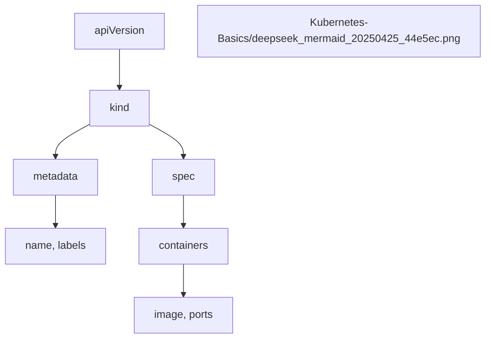

# **Comprehensive Study Material: Kubernetes YAML Fundamentals**

## **1. Introduction to YAML in Kubernetes**
### **Definition**
YAML (YAML Ain't Markup Language) is a human-readable data serialization format used for configuration files. In Kubernetes, YAML is used to define **manifests** (declarative configurations) for objects like Pods, ReplicaSets, Deployments, and Services.

### **Key Features of YAML**
- **Readability**: Designed to be clean and easy to read.
- **Key-Value Pairs**: Stores data in structured key-value pairs.
- **Supports Lists & Dictionaries**: Helps in defining complex configurations.
- **Extensions**: `.yml` or `.yaml` (both are valid).

---

## **2. YAML Basics for Kubernetes**
### **Core Topics Covered**
1. **Comments**  
   - Defined using `#` (hash symbol).  
   - Example:
     ```yaml
     # This is a comment
     name: John
     ```

2. **Key-Value Pairs**  
   - Syntax: `key: value`  
   - **Space after colon is mandatory**.  
   - Example:
     ```yaml
     name: Kalia
     age: 23
     city: Hyderabad
     ```

3. **Dictionary (Map)**  
   - Grouping properties under a parent key.  
   - Example:
     ```yaml
     Person:
       name: Kalia
       age: 23
       city: Hyderabad
     ```

4. **Arrays (Lists)**  
   - Defined using `-` (dash).  
   - Example:
     ```yaml
     Hobbies:
       - Cooking
       - Cycling
     ```
   - Alternative (inline list):
     ```yaml
     Hobbies: [Cooking, Cycling]
     ```

5. **Multiple Lists (Nested Structures)**  
   - Example:
     ```yaml
     Friends:
       - name: Friend1
         age: 23
       - name: Friend2
         age: 22
     ```

6. **Document Separator (`---`)**  
   - Used to separate multiple YAML documents in a single file.  
   - Example:
     ```yaml
     ---
     # Document 1
     name: John
     ---
     # Document 2
     name: Jane
     ```

---

## **3. Kubernetes YAML Structure**
### **Top-Level Fields in Kubernetes Manifests**
Every Kubernetes YAML file has **4 mandatory top-level fields**:

| Field | Description | Example |
|--------|-------------|---------|
| `apiVersion` | Kubernetes API version (e.g., `v1`, `apps/v1`) | `apiVersion: v1` |
| `kind` | Type of Kubernetes object (e.g., `Pod`, `Service`) | `kind: Pod` |
| `metadata` | Object metadata (name, labels, annotations) | `metadata: {name: my-pod}` |
| `spec` | Desired state of the object | `spec: {containers: [...]}` |

### **Example: Pod Definition**
```yaml
apiVersion: v1
kind: Pod
metadata:
  name: my-app-pod
  labels:
    app: my-app
spec:
  containers:
    - name: my-app-container
      image: stacksimplify/k8s-app:1.0.0
      ports:
        - containerPort: 80
```

---

## **4. Creating a Pod and NodePort Service**
### **Step 1: Pod Definition**
```yaml
apiVersion: v1
kind: Pod
metadata:
  name: my-app-pod
  labels:
    app: my-app
spec:
  containers:
    - name: my-app
      image: stacksimplify/k8s-app:1.0.0
      ports:
        - containerPort: 80
```
- **Explanation**:
  - `apiVersion: v1` → Uses core Kubernetes API.
  - `kind: Pod` → Defines a Pod.
  - `metadata.labels` → Used for service selectors.
  - `spec.containers` → Defines the container running inside the Pod.

### **Step 2: NodePort Service**
```yaml
apiVersion: v1
kind: Service
metadata:
  name: my-app-nodeport-service
spec:
  type: NodePort
  selector:
    app: my-app
  ports:
    - port: 80
      targetPort: 80
      nodePort: 31231
```
- **Explanation**:
  - `type: NodePort` → Exposes the service on a static port.
  - `selector: app: my-app` → Routes traffic to Pods with `app: my-app` label.
  - `nodePort: 31231` → External port to access the service.

### **Applying the Configurations**
```sh
kubectl create -f pod-definition.yaml
kubectl create -f nodeport-service.yaml
kubectl get pods
kubectl get svc
```

---

## **5. Best Practices**
1. **Use Labels Effectively**  
   - Helps in filtering and managing objects.
   - Example:
     ```yaml
     labels:
       app: my-app
       tier: frontend
     ```

2. **Avoid Direct Pod Creation**  
   - Use **Deployments** or **ReplicaSets** for managing Pods.

3. **Document Separators (`---`)**  
   - Useful when multiple manifests are in a single file.

4. **Indentation Matters**  
   - Always use **2 spaces** (not tabs) for consistency.

---

## **6. Summary Table: YAML vs. Imperative Commands**
| Task | Imperative Command | Declarative (YAML) |
|------|--------------------|-------------------|
| Create Pod | `kubectl run my-pod --image=nginx` | Define in `pod.yaml` |
| Expose Service | `kubectl expose pod my-pod --type=NodePort` | Define in `service.yaml` |
| Scale Deployment | `kubectl scale deploy/my-app --replicas=3` | Update `replicas` in YAML |

---

## **7. Visual Representation**
### **Pod & Service Interaction**
```
[NodePort Service (31231)]
       ↓
[Pod (app: my-app)] → Container (Port 80)
```

### **YAML Structure**


---

## **8. Further Reading**
- [Kubernetes Official Docs](https://kubernetes.io/docs/concepts/)
- [YAML Specification](https://yaml.org/spec/)

---
# **Comprehensive Study Material: Kubernetes ReplicaSets and Deployments with YAML**

## **1. Introduction to ReplicaSets & Deployments**
### **Definitions**
- **ReplicaSet**: Ensures a specified number of pod replicas are running at any given time.
- **Deployment**: A higher-level abstraction that manages ReplicaSets and provides declarative updates to Pods.

### **Key Differences**
| Feature | ReplicaSet | Deployment |
|---------|-----------|------------|
| **Purpose** | Maintains pod replicas | Manages ReplicaSets + enables rolling updates/rollbacks |
| **Update Strategy** | Manual scaling | Supports rolling updates, blue-green deployments |
| **Use Case** | Basic pod replication | Production-grade application management |


---

## **2. YAML Structure for ReplicaSets & Deployments**
### **Common Top-Level Fields**
```yaml
apiVersion: apps/v1  # Same for both
kind: ReplicaSet    # Or "Deployment"
metadata:
  name: myapp-rs
spec:
  replicas: 3       # Number of pod copies
  selector:         # Pod selection criteria
    matchLabels:
      app: myapp
  template:         # Pod template
    metadata:
      labels:
        app: myapp
    spec:
      containers:
      - name: myapp-container
        image: nginx:1.14.2
```

### **Key Sections Explained**
1. **`selector.matchLabels`**  
   - Must match the labels in `template.metadata.labels`.
   - Used to identify which Pods belong to this ReplicaSet/Deployment.

2. **`template`**  
   - Defines the Pod specification that will be replicated.

---

## **3. Creating a ReplicaSet**
### **Step-by-Step YAML Breakdown**
```yaml
apiVersion: apps/v1
kind: ReplicaSet
metadata:
  name: myapp2-rs
spec:
  replicas: 3
  selector:
    matchLabels:
      app: myapp2
  template:
    metadata:
      labels:
        app: myapp2
    spec:
      containers:
      - name: myapp2-container
        image: stacksimplify/k8s-app:2.0.0
        ports:
        - containerPort: 80
```

### **Key Observations**
- **Self-Healing**: If a Pod dies, the ReplicaSet creates a new one.
- **Scaling**: Change `replicas` to scale up/down.
- **Imperative Command**:
  ```sh
  kubectl apply -f replicaset-definition.yml
  kubectl get rs
  kubectl get pods
  ```

---

## **4. Creating a Deployment**
### **YAML Example (Modification from ReplicaSet)**
```yaml
apiVersion: apps/v1
kind: Deployment
metadata:
  name: myapp3-deployment
spec:
  replicas: 3
  selector:
    matchLabels:
      app: myapp3
  template:
    metadata:
      labels:
        app: myapp3
    spec:
      containers:
      - name: myapp3-container
        image: stacksimplify/k8s-app:3.0.0
        ports:
        - containerPort: 80
```

### **Why Use Deployments?**
1. **Rolling Updates**:  
   ```sh
   kubectl set image deployment/myapp3-deployment myapp3-container=nginx:1.16.1
   ```
2. **Rollback**:  
   ```sh
   kubectl rollout undo deployment/myapp3-deployment
   ```
3. **Status Monitoring**:  
   ```sh
   kubectl rollout status deployment/myapp3-deployment
   ```

---

## **5. NodePort Service for Accessing Pods**
### **Service YAML for ReplicaSet/Deployment**
```yaml
apiVersion: v1
kind: Service
metadata:
  name: myapp-nodeport-service
spec:
  type: NodePort
  selector:
    app: myapp2  # Matches ReplicaSet/Deployment label
  ports:
    - port: 80
      targetPort: 80
      nodePort: 31232  # External port (30000-32767)
```

### **Accessing the Application**
1. Get node IP:
   ```sh
   kubectl get nodes -o wide
   ```
2. Access via browser:  
   `http://<NodeIP>:31232`

---

## **6. Key Comparisons**
### **ReplicaSet vs Deployment**
| Feature | ReplicaSet | Deployment |
|---------|-----------|------------|
| **Pod Management** | Basic replication | Advanced lifecycle management |
| **Updates** | Manual | Supports rolling updates |
| **Rollback** | Not supported | Supported via `kubectl rollout undo` |
| **Use Case** | Static scaling | Dynamic app deployments |

### **Port Mapping Summary**
| Resource | NodePort | App Version |
|----------|---------|------------|
| Pod | 31231 | v1 |
| ReplicaSet | 31232 | v2 |
| Deployment | 31233 | v3 |

---

## **7. Hands-On Exercises**
### **Exercise 1: Scale a ReplicaSet**
1. Edit the YAML to change `replicas: 5`.
2. Apply changes:
   ```sh
   kubectl apply -f replicaset-definition.yml
   ```
3. Verify:
   ```sh
   kubectl get pods
   ```

### **Exercise 2: Update a Deployment**
1. Change the image version in the Deployment YAML.
2. Apply and monitor rollout:
   ```sh
   kubectl apply -f deployment-definition.yml
   kubectl rollout status deployment/myapp3-deployment
   ```

---

## **8. Best Practices**
1. **Always Use Deployments** (not bare ReplicaSets) for production.
2. **Label Consistently**: Ensure `selector.matchLabels` matches Pod labels.
3. **Avoid Direct Pod Deletion**: Let the controller manage Pods.
4. **Use `kubectl apply`** (not `create`) for declarative updates.

---

## **9. Troubleshooting**
| Issue | Solution |
|-------|----------|
| Pods not creating | Check `selector.matchLabels` matches Pod labels |
| Service not routing | Verify `spec.selector` matches Deployment/ReplicaSet labels |
| Image pull errors | Ensure image name/tag is correct |

---

## **10. Summary Cheat Sheet**
```sh
# Get ReplicaSets
kubectl get rs

# Get Deployments
kubectl get deployments

# Scale a Deployment
kubectl scale deployment/myapp3-deployment --replicas=5

# Update a Deployment
kubectl set image deployment/myapp3-deployment myapp3-container=nginx:latest

# Rollback
kubectl rollout undo deployment/myapp3-deployment
```

# **Comprehensive Study Material: Kubernetes Services with YAML**

## **1. Introduction to Kubernetes Services**
### **Definition**
A **Service** in Kubernetes is an abstraction that defines a logical set of Pods and a policy to access them. It enables:
- **Load balancing** across Pods
- **Service discovery** within the cluster
- **External access** to applications

### **Types of Services**
| Type | Description | Use Case |
|------|------------|----------|
| **ClusterIP** | Internal IP (default) | Communication between microservices |
| **NodePort** | Exposes on a static port (30000-32767) | External access for testing |
| **LoadBalancer** | Cloud provider's external LB | Production-grade external access |
| **ExternalName** | Maps to DNS name | Integrating external services |

---

## **2. Backend Deployment & ClusterIP Service**
### **Backend Deployment YAML**
```yaml
apiVersion: apps/v1
kind: Deployment
metadata:
  name: backend-rest-app
  labels:
    app: backend-rest-app
    tier: backend
spec:
  replicas: 3
  selector:
    matchLabels:
      app: backend-rest-app
  template:
    metadata:
      labels:
        app: backend-rest-app
        tier: backend
    spec:
      containers:
      - name: backend-rest-app
        image: stacksimplify/k8s-app:1.0.0
        ports:
        - containerPort: 8080
```

### **Backend ClusterIP Service YAML**
```yaml
apiVersion: v1
kind: Service
metadata:
  name: my-backend-service  # Must match frontend proxy config
  labels:
    app: backend-rest-app
    tier: backend
spec:
  selector:
    app: backend-rest-app  # Matches Pod labels
  ports:
    - name: http
      port: 8080           # Service port
      targetPort: 8080     # Pod port
```

### **Key Observations**
1. **Service-Selector-Pod Connection**:  
   - Service uses `selector.app=backend-rest-app` to route traffic to Pods with the same label.
2. **Port Mapping**:  
   - `port: 8080` → ClusterIP service port  
   - `targetPort: 8080` → Container port  

---

## **3. Frontend Deployment & NodePort Service**
### **Frontend Deployment YAML**
```yaml
apiVersion: apps/v1
kind: Deployment
metadata:
  name: frontend-nginx-app
  labels:
    app: frontend-nginx-app
    tier: frontend
spec:
  replicas: 3
  selector:
    matchLabels:
      app: frontend-nginx-app
  template:
    metadata:
      labels:
        app: frontend-nginx-app
        tier: frontend
    spec:
      containers:
      - name: frontend-nginx-app
        image: stacksimplify/k8s-frontend-nginx:1.0.0
        ports:
        - containerPort: 80
```

### **Frontend NodePort Service YAML**
```yaml
apiVersion: v1
kind: Service
metadata:
  name: frontend-nginx-service
  labels:
    app: frontend-nginx-app
    tier: frontend
spec:
  type: NodePort
  selector:
    app: frontend-nginx-app
  ports:
    - name: http
      port: 80            # Service port
      targetPort: 80      # Pod port
      nodePort: 31234     # External port (30000-32767)
```

### **Key Observations**
1. **NodePort Range**:  
   - Static port (`31234`) must be between **30000-32767**.
2. **External Access**:  
   - Accessible via `http://<NodeIP>:31234`.

---

## **4. End-to-End Testing**
### **1. Apply All Manifests**
```sh
kubectl apply -f kube-manifests/
```

### **2. Verify Resources**
```sh
kubectl get all
```
Expected Output:
```
NAME                                      READY   STATUS    RESTARTS   AGE
pod/backend-rest-app-7c5d8f8d6b-2qj5k     1/1     Running   0          1m
pod/frontend-nginx-app-6d8b7c9c7f-xwz9p   1/1     Running   0          1m

NAME                          TYPE        CLUSTER-IP      EXTERNAL-IP   PORT(S)        AGE
service/frontend-nginx-app    NodePort    10.96.123.45    <none>        80:31234/TCP   1m
service/my-backend-service    ClusterIP   10.96.67.89     <none>        8080/TCP       1m

NAME                                 READY   UP-TO-DATE   AVAILABLE   AGE
deployment.apps/backend-rest-app     3/3     3            3           1m
deployment.apps/frontend-nginx-app   3/3     3            3           1m
```

### **3. Access Frontend**
1. Get node IP:
   ```sh
   kubectl get nodes -o wide
   ```
2. Open in browser:  
   `http://<NodeIP>:31234`

### **4. Verify Load Balancing**
- Refresh the page multiple times.  
- Observe different Pod IDs in the response, confirming traffic is load-balanced.

---

## **5. Declarative Management with `kubectl apply`**
### **Apply All Manifests in a Directory**
```sh
kubectl apply -f kube-manifests/
```
- Creates/updates all resources defined in YAML files.

### **Delete All Resources**
```sh
kubectl delete -f kube-manifests/
```
- Deletes all resources defined in YAML files.

### **Best Practices**
1. **Atomic Operations**:  
   - Use `apply` for idempotent updates (creates if not exists, updates otherwise).
2. **Version Control**:  
   - Store YAML files in Git for change tracking.

---

## **6. Troubleshooting Guide**
| Issue | Solution |
|-------|----------|
| **Service not routing** | Verify `selector` matches Pod labels |
| **Port conflicts** | Ensure `nodePort` is unique (30000-32767) |
| **Image pull errors** | Check image name/tag in Deployment |
| **Pods not starting** | Inspect logs: `kubectl logs <pod-name>` |

---

## **7. Architecture Diagram**
```
[User]
  ↓ (http://NodeIP:31234)
[Frontend NodePort Service]
  ↓ (Load balances)
[Frontend Pods (nginx)] → [Backend ClusterIP Service] → [Backend Pods (SpringBoot)]
```

---

## **8. Key Takeaways**
1. **ClusterIP**: For internal service-to-service communication.
2. **NodePort**: For external access during development.
3. **Declarative Management**: Always use YAML + `kubectl apply`.
4. **Labels Matter**: Ensure `selector` matches Pod labels.

---

## **9. Hands-On Exercise**
### **Task: Scale Frontend Deployment**
1. Edit `frontend-deployment.yaml`:
   ```yaml
   replicas: 5
   ```
2. Apply changes:
   ```sh
   kubectl apply -f frontend-deployment.yaml
   ```
3. Verify:
   ```sh
   kubectl get pods
   ```

---

