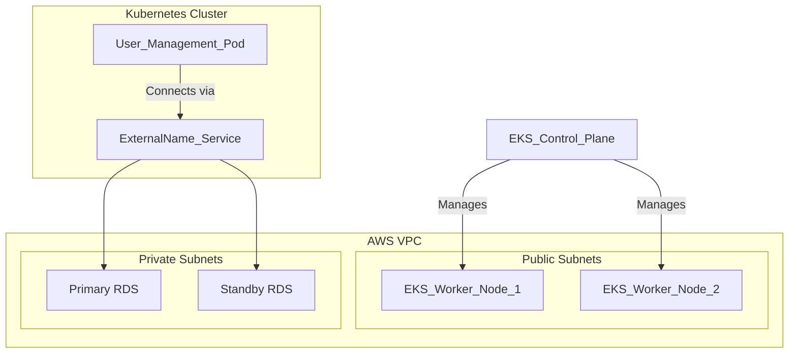
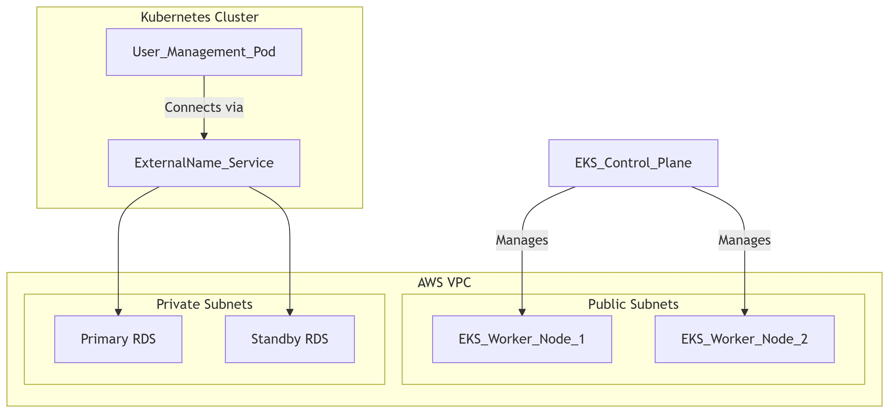

# Kubernetes with RDS Database - Comprehensive Study Guide

## Table of Contents
1. [Introduction to RDS with Kubernetes](#introduction-to-rds-with-kubernetes)
2. [Architecture Overview](#architecture-overview)
3. [Implementation Steps](#implementation-steps)
4. [ExternalName Service](#externalname-service)
5. [Best Practices](#best-practices)
6. [Comparison: EBS vs RDS](#comparison-ebs-vs-rds)

## Introduction to RDS with Kubernetes

### Why Use RDS Instead of Database Pods in Kubernetes?

Running databases like MySQL as pods inside Kubernetes clusters presents several challenges:

1. **Complex HA Setup**: Implementing high availability requires significant manual configuration
2. **MySQL Expertise Needed**: Requires deep MySQL administration knowledge
3. **Storage Limitations**: EBS volumes are zone-restricted
4. **Management Overhead**: No built-in backup/recovery or auto-upgrade capabilities

**Solution**: Use Amazon RDS (Relational Database Service) which provides:
- Built-in high availability
- Automated backups
- Read replicas
- Monitoring
- Automatic upgrades
- Multi-AZ deployments

## Architecture Overview

### AWS EKS with RDS Architecture






### Key Components:
1. **EKS Cluster**: Runs application workloads
2. **RDS Database**: In private subnets for security
3. **ExternalName Service**: Kubernetes abstraction to connect to RDS
4. **Security Groups**: Controls access to RDS

## Implementation Steps

### Prerequisite Setup

1. **Create Security Group**:
   ```bash
   aws ec2 create-security-group \
       --group-name "eks-rds-db-sg" \
       --description "Allow access for RDS database on port 3306" \
       --vpc-id <your-vpc-id>
       
   aws ec2 authorize-security-group-ingress \
       --group-id <sg-id> \
       --protocol tcp \
       --port 3306 \
       --cidr 0.0.0.0/0
   ```

2. **Create DB Subnet Group**:
   ```bash
   aws rds create-db-subnet-group \
       --db-subnet-group-name "eks-rds-db-subnet-group" \
       --db-subnet-group-description "EKS RDS DB subnet group" \
       --subnet-ids <private-subnet-1> <private-subnet-2>
   ```

### Creating RDS Database

1. **Using AWS Console**:
   - Engine: MySQL
   - Template: Free tier
   - DB instance identifier: user-mgmt-db
   - Master username: dbadmin
   - Master password: DBpassword11
   - VPC: EKS cluster VPC
   - Subnet group: eks-rds-db-subnet-group
   - Public access: No
   - Security group: eks-rds-db-sg

2. **Verify Creation**:
   ```bash
   aws rds describe-db-instances --db-instance-identifier user-mgmt-db
   ```

## ExternalName Service

### What is ExternalName Service?

A Kubernetes service that maps to an external DNS name (like RDS endpoint) rather than cluster-internal pods.

### Manifest Example

```yaml
apiVersion: v1
kind: Service
metadata:
  name: mysql
  namespace: default
spec:
  type: ExternalName
  externalName: user-mgmt-db.xxxxxxxxxx.us-east-1.rds.amazonaws.com
```

### Connecting to RDS from Kubernetes

1. **Create Database Schema**:
   ```bash
   kubectl run mysql-client --rm -it --image=mysql:5.7 -- \
       mysql -h user-mgmt-db.xxxxxxxxxx.us-east-1.rds.amazonaws.com \
       -u dbadmin -pDBpassword11
       
   # Inside MySQL shell
   CREATE DATABASE user_mgmt_db;
   ```

2. **Update Application Deployment**:
   ```yaml
   env:
   - name: DB_USERNAME
     value: "dbadmin"
   - name: DB_PASSWORD
     valueFrom:
       secretKeyRef:
         name: mysql-db-password
         key: password
   - name: DB_URL
     value: "jdbc:mysql://mysql:3306/user_mgmt_db"
   ```

## Best Practices

### Security Considerations
1. **Network Isolation**:
   - Place RDS in private subnets
   - Restrict security group access to only EKS worker nodes

2. **Credentials Management**:
   - Use Kubernetes Secrets for database credentials
   - Rotate passwords regularly

### Performance Optimization
1. **Connection Pooling**:
   ```yaml
   # In application deployment
   - name: DB_CONNECTION_POOL_SIZE
     value: "10"
   ```

2. **Read Replicas**:
   - Create read replicas for read-heavy workloads
   - Use different ExternalName services for write vs read endpoints

### Cost Management
1. **Instance Sizing**:
   - Start with t3.micro for dev/test
   - Monitor performance metrics before scaling up

2. **Backup Policies**:
   ```bash
   aws rds modify-db-instance \
       --db-instance-identifier user-mgmt-db \
       --backup-retention-period 7 \
       --preferred-backup-window "02:00-03:00"
   ```

## Comparison: EBS vs RDS

| Feature               | EBS with MySQL Pod | Amazon RDS          |
|-----------------------|---------------------|---------------------|
| High Availability     | Manual setup        | Built-in            |
| Backups               | Manual              | Automated           |
| Scaling               | Complex             | Simple API calls    |
| Maintenance           | Self-managed        | AWS-managed         |
| Multi-AZ              | Difficult           | One-click           |
| Monitoring            | Setup required      | Built-in            |
| Cost                  | Lower initial       | Higher but includes |
|                       |                     | management features |
| Expertise Required    | MySQL admin needed  | Minimal DBA needed  |

## Troubleshooting

### Common Issues and Solutions

1. **Connection Timeouts**:
   - Verify security group rules
   - Check VPC routing tables
   - Test connectivity from worker node:
     ```bash
     kubectl run -it --rm --image=alpine test-pod -- sh
     nc -zv user-mgmt-db.xxxxxxxxxx.us-east-1.rds.amazonaws.com 3306
     ```

2. **Authentication Failures**:
   - Verify secrets are correctly mounted
   - Check RDS master username/password

3. **Performance Issues**:
   - Monitor RDS metrics in CloudWatch
   - Consider read replicas for read-heavy workloads
   - Upgrade instance type if needed

## Cleanup

To avoid unnecessary charges:

1. **Delete RDS Instance**:
   ```bash
   aws rds delete-db-instance \
       --db-instance-identifier user-mgmt-db \
       --skip-final-snapshot
   ```

2. **Remove Kubernetes Resources**:
   ```bash
   kubectl delete -f mysql-externalname-service.yaml
   kubectl delete secret mysql-db-password
   ```

3. **Cleanup Networking**:
   ```bash
   aws rds delete-db-subnet-group --db-subnet-group-name eks-rds-db-subnet-group
   aws ec2 delete-security-group --group-id <sg-id>
   ```