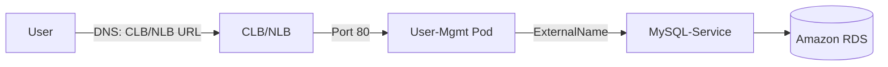

Here's a detailed study material prepared from the provided transcript, covering AWS Load Balancers in Kubernetes with definitions, examples, and architectural explanations:

---

# **AWS Load Balancers in Kubernetes - Deep Dive**

## **1. Types of AWS Elastic Load Balancers (ELB)**
AWS provides three types of load balancers for high availability:

| Type                 | Protocols Supported          | Use Case                              | Key Features                          |
|----------------------|-----------------------------|---------------------------------------|---------------------------------------|
| **Classic (CLB)**    | TCP, HTTP/HTTPS, SSL        | Legacy applications                   | Deprecated, works with EC2 Classic/VPC |
| **Application (ALB)**| HTTP/HTTPS                  | Layer 7 routing (path/host-based)     | Advanced features (WAF, redirects)    |
| **Network (NLB)**    | TCP, UDP, TLS               | Low-latency, high-throughput apps     | Static IP, handles volatile traffic   |

**Key Point**:  
- CLB is **default** when creating a `LoadBalancer` service in Kubernetes on AWS.
- ALB is feature-rich (covered in Section 8 of the course).

---

## **2. Classic Load Balancer (CLB) Implementation**
### **Steps to Deploy CLB in Kubernetes**
1. **Modify Service Manifest**:
   ```yaml
   apiVersion: v1
   kind: Service
   metadata:
     name: clb-user-mgmt-rest-app
   spec:
     type: LoadBalancer  # Defaults to CLB in AWS
     ports:
       - port: 80        # Listener port (browser-friendly)
         targetPort: 8095 # App container port
     selector:
       app: user-mgmt-rest-app
   ```
   - **Change from NodePort**: Removes `nodePort` field and sets `type: LoadBalancer`.

2. **Verify Creation**:
   ```bash
   kubectl get svc
   ```
   Output shows the CLB’s external DNS (e.g., `a1234.elb.amazonaws.com`).

3. **AWS Console Validation**:
   - Navigate to **EC2 > Load Balancers** to see the auto-created CLB.

---

## **3. Network Load Balancer (NLB) Implementation**
### **Differences from CLB**
- Operates at **Layer 4 (TCP/UDP)**.
- Uses **static IPs** (vs. DNS in CLB/ALB).
- Ideal for non-HTTP traffic (e.g., gaming, IoT).

### **Kubernetes Manifest with Annotations**
```yaml
apiVersion: v1
kind: Service
metadata:
  name: nlb-user-mgmt-rest-app
  annotations:
    service.beta.kubernetes.io/aws-load-balancer-type: "nlb"  # Force NLB creation
spec:
  type: LoadBalancer
  ports:
    - port: 80
      targetPort: 8095
  selector:
    app: user-mgmt-rest-app
```

**Key Annotation**:  
`service.beta.kubernetes.io/aws-load-balancer-type: "nlb"` overrides the default CLB behavior.

---

## **4. Architectural Flow**
### **CLB/NLB Traffic Flow**


### **Key Components**
1. **Worker Nodes in Private Subnets**:
   - Nodes communicate with EKS control plane via **NAT Gateway** (no public IPs).
   - Verified by:
     ```bash
     kubectl get nodes -o wide  # ExternalIP = "none"
     ```

2. **ExternalName Service**:
   - Resolves to RDS endpoint:
     ```yaml
     kind: Service
     metadata:
       name: mysql-service
     spec:
       type: ExternalName
       externalName: mydb.123.us-east-1.rds.amazonaws.com
     ```

---

## **5. Testing & Validation**
### **Browser/Postman Tests**
1. **Health Check**:
   ```
   http://<CLB-DNS>/user-mgmt/health-status
   ```
   Response: `{"status": "User Management Service Running"}`

2. **Create User via API**:
   ```bash
   POST http://<NLB-DNS>/user-mgmt/users
   Body: {"username": "admin3", "email": "admin3@test.com"}
   ```

3. **List Users**:
   ```bash
   GET http://<NLB-DNS>/user-mgmt/users
   ```
   Response: Lists all users stored in RDS.

---

## **6. Cleanup**
```bash
kubectl delete -f kube-manifests/  # Deletes CLB/NLB, services, and deployments
```
**AWS Console**: Confirm load balancers are deleted under **EC2 > Load Balancers**.

---

## **7. Key Takeaways**
- **CLB**: Legacy, auto-created by Kubernetes `LoadBalancer` services (deprecated).
- **NLB**: Layer 4, requires annotations, better for TCP/UDP.
- **Private Subnets**: Worker nodes use NAT gateways for outbound traffic.
- **ExternalName**: Maps Kubernetes services to external endpoints (e.g., RDS).

---
