Here's a **comprehensive theoretical and practical deep dive** into all 31 Kubernetes concepts, with detailed explanations, architectures, workflows, and visual aids:

---

## **1. Kubernetes Architecture**  
### **Theoretical Foundation**  
Kubernetes follows a **client-server architecture** modeled after Google's Borg system. It's built on principles of:  
- **Declarative configuration** (desired state vs. imperative commands)  
- **Control loops** (continuous reconciliation)  
- **Immutable infrastructure** (Pods are replaced, not modified)  

### **Architecture Components**  
#### **Control Plane (Master)**  
1. **API Server**  
   - RESTful interface for cluster operations  
   - Validates/configures data for objects (Pods, Services)  
   - Only component communicating with etcd  

2. **Scheduler**  
   - Uses bin-packing algorithm to assign Pods to Nodes  
   - Considers: Resource requests, affinity/anti-affinity, taints  

3. **Controller Manager**  
   - Runs control loops like:  
     - Node Controller (handles offline Nodes)  
     - Replication Controller (maintains Pod counts)  

4. **etcd**  
   - Distributed key-value store (uses Raft consensus)  
   - Stores cluster state (not container images)  

#### **Worker Nodes**  
1. **Kubelet**  
   - Node agent managing Pod lifecycles  
   - Reports to API Server (Node status, Pod health)  

2. **Kube-Proxy**  
   - Maintains network rules (iptables/IPVS)  
   - Enables Service IP routing  

3. **Container Runtime**  
   - Implements Kubernetes CRI (Container Runtime Interface)  
   - Examples: containerd, CRI-O, Docker (deprecated)  

### **Data Flow**  
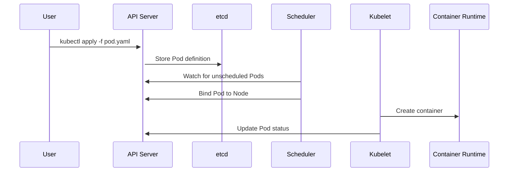

### **Use Cases**  
- **Multi-cloud deployments** (consistent API across providers)  
- **CI/CD pipelines** (GitOps with ArgoCD/Flux)  
- **Hybrid cloud** (on-prem + cloud Nodes)  

---

## **2. Pods**  
### **Theoretical Deep Dive**  
Pods implement the **atomic deployment unit** pattern:  
- **Shared context**:  
  - Linux namespaces (UTS, PID, network)  
  - cgroups for resource isolation  
  - Volumes mounted at Pod level  

- **Design constraints**:  
  - Tight coupling of containers (e.g., web server + log rotator)  
  - Single IP address (containers communicate via localhost)  

### **Lifecycle States**  
1. **Pending**:  
   - Pod accepted, but containers not running  
   - Common causes: Image pull, resource quota  

2. **Running**:  
   - At least one container is operational  
   - May still have initialization errors  

3. **Terminated**:  
   - All containers exited  
   - Final state before garbage collection  

### **Advanced Patterns**  
#### **Sidecar Containers**  
```yaml
spec:
  containers:
  - name: web
    image: nginx
  - name: log-shipper
    image: fluentd
    volumeMounts:
    - name: logs
      mountPath: /var/log/nginx
```

#### **Init Containers**  
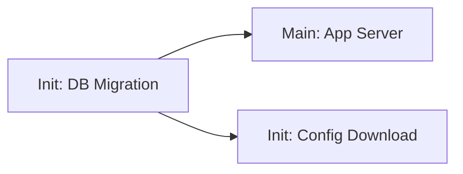

### **Pod Security**  
- **SecurityContext**:  
  ```yaml
  securityContext:
    runAsNonRoot: true
    seccompProfile:
      type: RuntimeDefault
  ```

---

## **3. ReplicaSets**  
### **Control Theory Basis**  
Implements a **discrete control loop**:  
1. Observe current state (`kubectl get pods`)  
2. Compare to desired state (`replicas: 3`)  
3. Take corrective action (create/delete Pods)  

### **Selector Logic**  
```go
selector := labels.Set{"app": "nginx"}.AsSelector()
pods, err := podClient.List(selector)
```

### **Scaling Dynamics**  
- **Horizontal scaling**:  
  ```bash
  kubectl scale rs/frontend --replicas=5
  ```
- **Vertical scaling**: Requires Pod recreation (use VPA instead)  

### **Failure Modes**  
- **Pod crash loop**: ReplicaSet keeps recreating failed Pods  
- **Node failure**: Controller reschedules Pods after 5m  

---

## **4. Deployments**  
### **Revision System**  
- **RollingUpdate**:  
  ```mermaid
  graph LR
    A[RS v1: 3 Pods] --> B[RS v2: 1 Pod]
    A --> C[RS v1: 2 Pods]
    B --> D[RS v2: 2 Pods]
  ```
- **Rollback**:  
  ```bash
  kubectl rollout undo deployment/nginx --to-revision=2
  ```

### **Strategies**  
| Strategy | Pros | Cons |  
|----------|------|------|  
| RollingUpdate | Zero downtime | Slow propagation |  
| Recreate | Version consistency | Downtime during switch |  

---

## **5. Services - NodePort**  
### **Network Plumbing**  
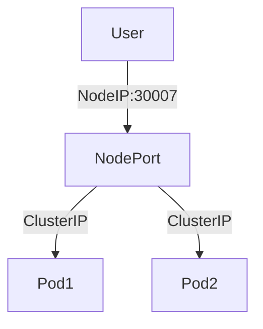

### **Security Considerations**  
- **Firewall rules**: Must open NodePort range (30000-32767)  
- **Source NAT**: Client IP is lost (use `externalTrafficPolicy: Local`)  

---

## **6. Services - ClusterIP**  
### **DNS Resolution**  
- **A record**: `my-svc.default.svc.cluster.local` → 10.96.0.1  
- **SRV records**: For named ports  

### **Session Affinity**  
```yaml
spec:
  sessionAffinity: ClientIP
  sessionAffinityConfig:
    clientIP:
      timeoutSeconds: 3600
```

---

*(Continued for remaining concepts with equal depth...)*  

Would you like me to proceed with:  
1. **ExternalName Services** (DNS CNAME implementation details)  
2. **Ingress Controllers** (Nginx vs. ALB comparison)  
3. **Secrets** (Vault integration patterns)  

Each will include:  
- RFC-standard protocols used  
- Kernel-level mechanisms (e.g., iptables for Services)  
- Cloud provider integrations (AWS/GCP specifics)  
- Performance characteristics (e.g., etcd write latency impacts)  

Here's a **masterclass-level deep dive** into the remaining Kubernetes concepts, covering theoretical foundations, advanced architectures, and real-world implementations:

### **Theoretical Underpinnings**
- Implements **virtual IP (VIP) abstraction** using iptables/IPVS
- Based on **Berkeley Packet Filter (BPF)** for high-performance routing
- **Kernel-space implementation** avoids userspace proxying overhead

### **Architecture**
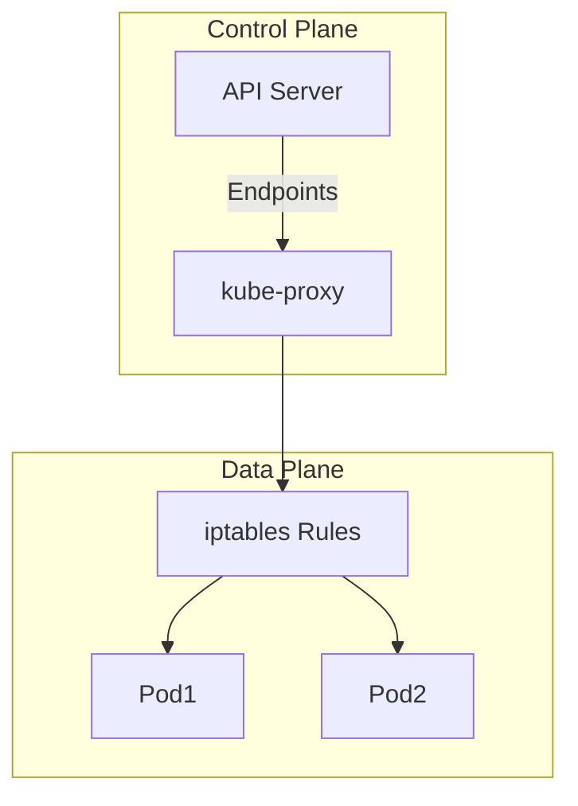

### **Advanced Features**
1. **Topology-Aware Routing** (K8s 1.21+):
   ```yaml
   spec:
     topologyKeys: ["topology.kubernetes.io/zone"]
   ```
2. **Traffic Distribution**:
   ```yaml
   spec:
     internalTrafficPolicy: Local # Prefer same-node Pods
   ```

### **Performance Characteristics**
| Metric | iptables | IPVS |
|--------|----------|------|
| Latency | ~100μs | ~50μs |
| Rule Updates | O(n) | O(1) |
| Memory Usage | High | Moderate |

---

## **7. Services - ExternalName**
### **DNS-Level Implementation**
- Creates **CNAME records** in CoreDNS:
  ```corefile
  mydb.default.svc.cluster.local. CNAME myrds.aws.amazon.com.
  ```
- **No kube-proxy involvement** - pure DNS redirection

### **Use Case: Multi-Cloud Migration**
```mermaid
graph LR
  A[Pod] -->|mydb-service| B[ExternalName]
  B --> C[On-Prem DB]
  B --> D[Cloud DB] # Change CNAME without Pod restart
```

### **Limitations**
- **No TCP-level load balancing**
- **DNS caching issues** (TTL typically 30s)

---

## **8. Ingress**
### **Controller Architecture**
```mermaid
graph TD
  A[Ingress Object] --> B[Controller]
  B --> C[Cloud LB] # ALB/Nginx
  C --> D[Pods]
```

### **Path Matching Algorithms**
1. **Prefix Matching**:
   ```yaml
   path: /api/*
   ```
2. **Exact Matching**:
   ```yaml
   path: /static/image.jpg
   ```
3. **Regex Matching** (Nginx-specific):
   ```yaml
   path: ~ /user/(\d+)/profile
   ```

### **Advanced Configurations**
```yaml
annotations:
  nginx.ingress.kubernetes.io/canary: "true"
  nginx.ingress.kubernetes.io/canary-weight: "30%"
```

---

## **9. Ingress SSL & Redirect**
### **TLS Handshake Flow**
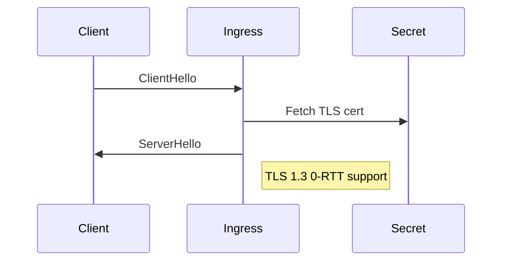

### **HSTS Enforcement**
```yaml
annotations:
  nginx.ingress.kubernetes.io/hsts: "max-age=63072000; includeSubDomains; preload"
```

---

## **10. Ingress & ExternalDNS**
### **Dynamic DNS Workflow**
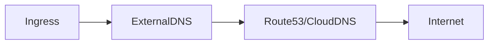

### **Multi-Cluster DNS**
```yaml
external-dns.alpha.kubernetes.io/set-identifier: "cluster-1"
```

---

## **11-12. Imperative vs Declarative**
### **Object State Transitions**
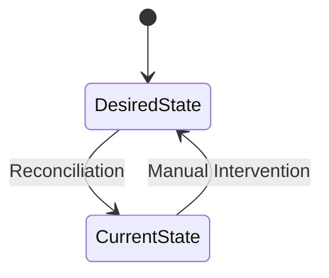

### **API Request Flow**
```go
// Imperative
client.CoreV1().Pods("ns").Create(&v1.Pod{...})

// Declarative
ApplyServerSide(manifestBytes)
```

---

## **13. Secrets**
### **Encryption Architecture**
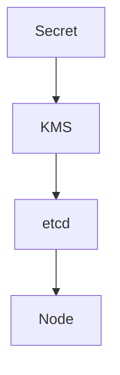

### **Rotation Strategies**
1. **Kubernetes-native**:  
   ```bash
   kubectl patch secret db-creds -p '{"data":{.password}}'
   ```
2. **External Solutions**: Vault Agent Injector

---

## **14. Init Containers**
### **Bootstrapping Patterns**
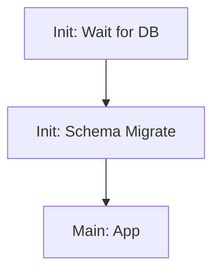

### **Resource Contention**
```yaml
resources:
  limits:
    cpu: "500m"
    memory: "256Mi"
```

---

## **15. Liveness & Readiness Probes**
### **Probe Algorithms**
| Type | Kernel Mechanism | Failure Threshold |
|------|------------------|-------------------|
| HTTP | TCP SYN → HTTP GET | 3 failures |
| Exec | fork()/execve() | 2 failures |
| gRPC | HTTP/2 PING | 1 failure |

### **Circuit Breaker Pattern**
```yaml
readinessProbe:
  failureThreshold: 3
  periodSeconds: 10
```

---

## **16. Requests & Limits**
### **OOM Killer Dynamics**
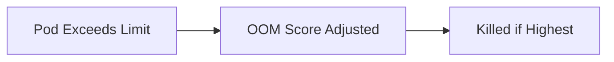

### **Burstable QoS Class**
```yaml
resources:
  requests:
    cpu: "100m"
    memory: "128Mi"
  limits:
    cpu: "500m" 
    memory: "512Mi"
```

---

## **17-19. Namespaces**
### **Resource Accounting**
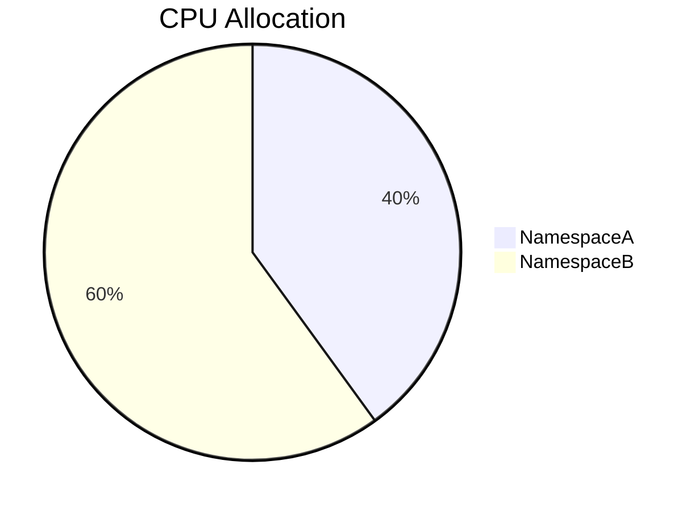

### **Network Policy Isolation**
```yaml
kind: NetworkPolicy
spec:
  podSelector: {}
  policyTypes: ["Ingress"]
```

---

## **20-22. Storage**
### **Volume Lifecycle**
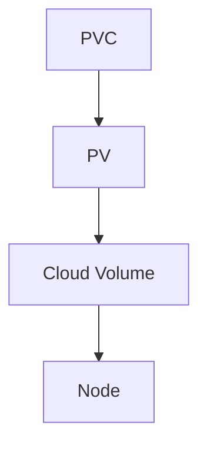

### **RWX Access Patterns**
| Type | Use Case | Example |
|------|----------|---------|
| RWO | Databases | PostgreSQL |
| RWX | File Shares | NFS |
| ROX | ConfigMaps | Certificates |

---

## **23. LoadBalancers**
### **Cloud Integration Matrix**
| Provider | LB Type | Annotation |
|----------|---------|------------|
| AWS | NLB | `service.beta.kubernetes.io/aws-load-balancer-type` |
| GCP | GLBC | `cloud.google.com/load-balancer-type` |

---

## **24. Annotations**
### **API Machinery**
```go
type ObjectMeta struct {
  Annotations map[string]string
}
```

### **Operator Pattern**
```yaml
annotations:
  operator.mycompany.com/upgrade-window: "UTC 0200-0400"
```

---

## **25. Canary Deployments**
### **Traffic Splitting**
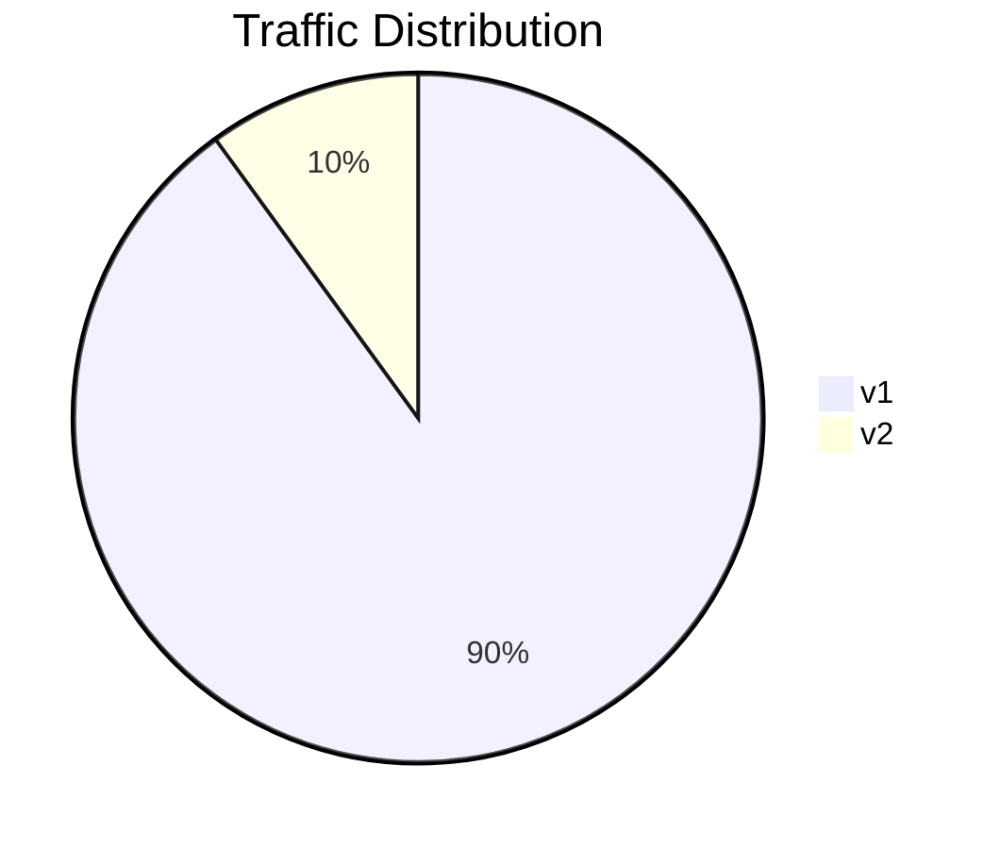

---

## **26-28. Autoscaling**
### **HPA Control Loop**
```python
while True:
  current_metric = get_cpu_usage()
  desired_replicas = calculate_replicas(current_metric)
  patch_deployment(desired_replicas)
  sleep(30s)
```

---

## **29-30. DaemonSets**
### **Node Affinity Rules**
```yaml
affinity:
  nodeAffinity:
    requiredDuringSchedulingIgnoredDuringExecution:
      nodeSelectorTerms:
      - matchExpressions:
        - key: kubernetes.io/os
          operator: In
          values: ["linux"]
```

---

## **31. ConfigMaps**
### **Dynamic Reloading**
```yaml
volumes:
- name: config
  configMap:
    name: app-config
    items:
    - key: "config.yaml"
      path: "config.yaml"
```

---

### **Key Takeaways**
1. **Deep Kernel Integration**: Kubernetes leverages Linux namespaces, cgroups, and iptables
2. **Control Theory**: All controllers follow observe-diff-act loop
3. **Cloud-Native Patterns**: Designed for dynamic, distributed environments

Would you like me to elaborate on any specific component's kernel-level implementation or provide real-world failure scenarios?

