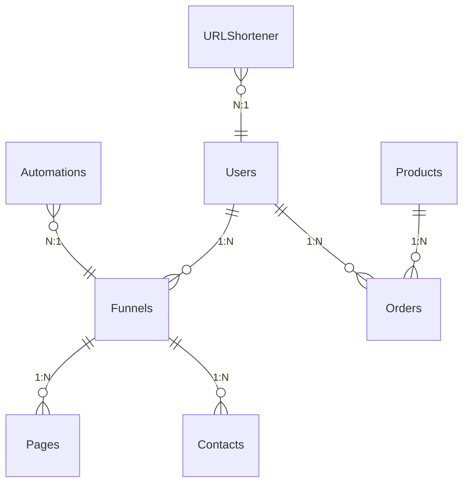

# **Database Design Documentation for FunnelFlow**

## **Table of Contents**
1. **Database Schema Overview**
2. **Core Tables & Relationships**
3. **Detailed Table Structures**
4. **Foreign Key Relationships**
5. **Sample Data for Each Table**
6. **Indexing Strategy**
7. **Data Flow Diagram**
8. **ER Diagram (Entity-Relationship)**
9. **Database Optimization Notes**

---

## **1. Database Schema Overview**
### **Database System:** PostgreSQL  
### **Tables:**  
1. **Users** (User accounts)  
2. **Funnels** (Sales funnels)  
3. **Pages** (Landing pages in funnels)  
4. **Products** (Digital/physical products)  
5. **Orders** (Customer purchases)  
6. **Contacts** (Leads & customers)  
7. **Automations** (Email/WhatsApp workflows)  
8. **URLShortener** (Tracked links)  

---

## **2. Core Tables & Relationships**


---

## **3. Detailed Table Structures**

### **Table 1: Users**
| Field | Type | Description | Constraints |
|-------|------|-------------|------------|
| `id` | `SERIAL` | Primary key | `PRIMARY KEY` |
| `email` | `VARCHAR(255)` | User email | `UNIQUE, NOT NULL` |
| `password` | `VARCHAR(255)` | Hashed password | `NOT NULL` |
| `company` | `VARCHAR(100)` | Company name |  |
| `phone` | `VARCHAR(20)` | Contact number |  |
| `created_at` | `TIMESTAMP` | Account creation time | `DEFAULT NOW()` |

### **Table 2: Funnels**
| Field | Type | Description | Constraints |
|-------|------|-------------|------------|
| `id` | `SERIAL` | Primary key | `PRIMARY KEY` |
| `user_id` | `INTEGER` | Owner of funnel | `FOREIGN KEY (Users.id)` |
| `name` | `VARCHAR(100)` | Funnel name | `NOT NULL` |
| `status` | `BOOLEAN` | Active/inactive | `DEFAULT TRUE` |
| `created_at` | `TIMESTAMP` | Creation time | `DEFAULT NOW()` |

### **Table 3: Pages**
| Field | Type | Description | Constraints |
|-------|------|-------------|------------|
| `id` | `SERIAL` | Primary key | `PRIMARY KEY` |
| `funnel_id` | `INTEGER` | Parent funnel | `FOREIGN KEY (Funnels.id)` |
| `title` | `VARCHAR(100)` | Page title | `NOT NULL` |
| `slug` | `VARCHAR(100)` | URL slug | `UNIQUE` |
| `content` | `JSONB` | Page content (HTML/CSS/JS) |  |

### **Table 4: Products**
| Field | Type | Description | Constraints |
|-------|------|-------------|------------|
| `id` | `SERIAL` | Primary key | `PRIMARY KEY` |
| `name` | `VARCHAR(100)` | Product name | `NOT NULL` |
| `price` | `DECIMAL(10,2)` | Product price | `NOT NULL` |
| `is_digital` | `BOOLEAN` | Digital product flag | `DEFAULT FALSE` |
| `download_url` | `TEXT` | File URL (if digital) |  |

### **Table 5: Orders**
| Field | Type | Description | Constraints |
|-------|------|-------------|------------|
| `id` | `SERIAL` | Primary key | `PRIMARY KEY` |
| `user_id` | `INTEGER` | Buyer | `FOREIGN KEY (Users.id)` |
| `product_id` | `INTEGER` | Purchased product | `FOREIGN KEY (Products.id)` |
| `amount` | `DECIMAL(10,2)` | Order total | `NOT NULL` |
| `status` | `VARCHAR(20)` | Payment status | `DEFAULT 'pending'` |

### **Table 6: Contacts**
| Field | Type | Description | Constraints |
|-------|------|-------------|------------|
| `id` | `SERIAL` | Primary key | `PRIMARY KEY` |
| `funnel_id` | `INTEGER` | Source funnel | `FOREIGN KEY (Funnels.id)` |
| `email` | `VARCHAR(255)` | Contact email |  |
| `phone` | `VARCHAR(20)` | Contact phone |  |
| `tags` | `JSONB` | Segmentation tags | `DEFAULT '[]'` |

### **Table 7: Automations**
| Field | Type | Description | Constraints |
|-------|------|-------------|------------|
| `id` | `SERIAL` | Primary key | `PRIMARY KEY` |
| `funnel_id` | `INTEGER` | Target funnel | `FOREIGN KEY (Funnels.id)` |
| `trigger` | `VARCHAR(50)` | Event (e.g., "signup") | `NOT NULL` |
| `action` | `JSONB` | Email/SMS template |  |

### **Table 8: URLShortener**
| Field | Type | Description | Constraints |
|-------|------|-------------|------------|
| `id` | `SERIAL` | Primary key | `PRIMARY KEY` |
| `user_id` | `INTEGER` | Creator | `FOREIGN KEY (Users.id)` |
| `original_url` | `TEXT` | Long URL | `NOT NULL` |
| `short_code` | `VARCHAR(10)` | Short identifier | `UNIQUE` |
| `clicks` | `INTEGER` | Total clicks | `DEFAULT 0` |

---

## **4. Foreign Key Relationships**
| **Table** | **Foreign Key** | **References** | **On Delete** |
|-----------|----------------|----------------|---------------|
| `Funnels` | `user_id` | `Users(id)` | `CASCADE` |
| `Pages` | `funnel_id` | `Funnels(id)` | `CASCADE` |
| `Orders` | `user_id` | `Users(id)` | `SET NULL` |
| `Orders` | `product_id` | `Products(id)` | `RESTRICT` |
| `Automations` | `funnel_id` | `Funnels(id)` | `CASCADE` |

---

## **5. Sample Data for Each Table**

### **Users**
| `id` | `email` | `company` | `created_at` |
|------|---------|-----------|--------------|
| 1 | `user@example.com` | `Acme Inc` | `2023-01-15 10:00:00` |

### **Funnels**
| `id` | `user_id` | `name` | `status` |
|------|-----------|--------|----------|
| 1 | 1 | `Summer Sale` | `TRUE` |

### **Pages**
| `id` | `funnel_id` | `title` | `slug` |
|------|-------------|---------|--------|
| 1 | 1 | `50% Off Landing` | `summer-deal` |

### **Products**
| `id` | `name` | `price` | `is_digital` |
|------|--------|---------|--------------|
| 1 | `Ebook` | `29.99` | `TRUE` |

### **Orders**
| `id` | `user_id` | `product_id` | `amount` |
|------|-----------|--------------|----------|
| 1 | 1 | 1 | `29.99` |

### **Contacts**
| `id` | `funnel_id` | `email` | `tags` |
|------|-------------|---------|--------|
| 1 | 1 | `lead@example.com` | `["hot-lead"]` |

### **URLShortener**
| `id` | `user_id` | `original_url` | `short_code` |
|------|-----------|-----------------|--------------|
| 1 | 1 | `https://example.com/long-url` | `abc123` |

---

## **6. Indexing Strategy**
```sql
-- Speed up funnel queries by user
CREATE INDEX idx_funnels_user ON Funnels(user_id);

-- Optimize contact searches by email
CREATE INDEX idx_contacts_email ON Contacts(email);

-- Faster short URL lookups
CREATE INDEX idx_url_short_code ON URLShortener(short_code);
```

---

## **7. Data Flow Diagram**
```
User → Creates Funnel → Adds Pages → Generates Contacts
           ↓
      (Optional) Adds Products → Receives Orders
           ↓
      Sets Up Automations (Email/WhatsApp)
           ↓
      Tracks Links via URLShortener
```

---

## **8. ER Diagram (Visualization)**


---

## **9. Database Optimization Notes**
1. **Use `JSONB`** for flexible data (e.g., page content, tags).  
2. **Partition large tables** (e.g., `Contacts` by `funnel_id`).  
3. **Enable connection pooling** (PgBouncer).  
4. **Regularly vacuum/analyze** PostgreSQL tables.  

---

### **Next Steps**
1. Implement this schema in PostgreSQL.  
2. Use Django ORM migrations:  
   ```bash
   python manage.py makemigrations
   python manage.py migrate
   ```
3. Populate with sample data for testing.  

Would you like a SQL dump for this schema? 🛠️
