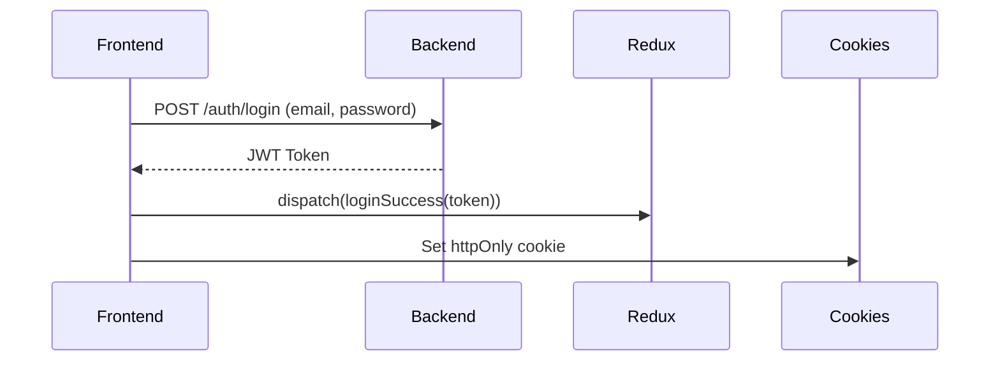
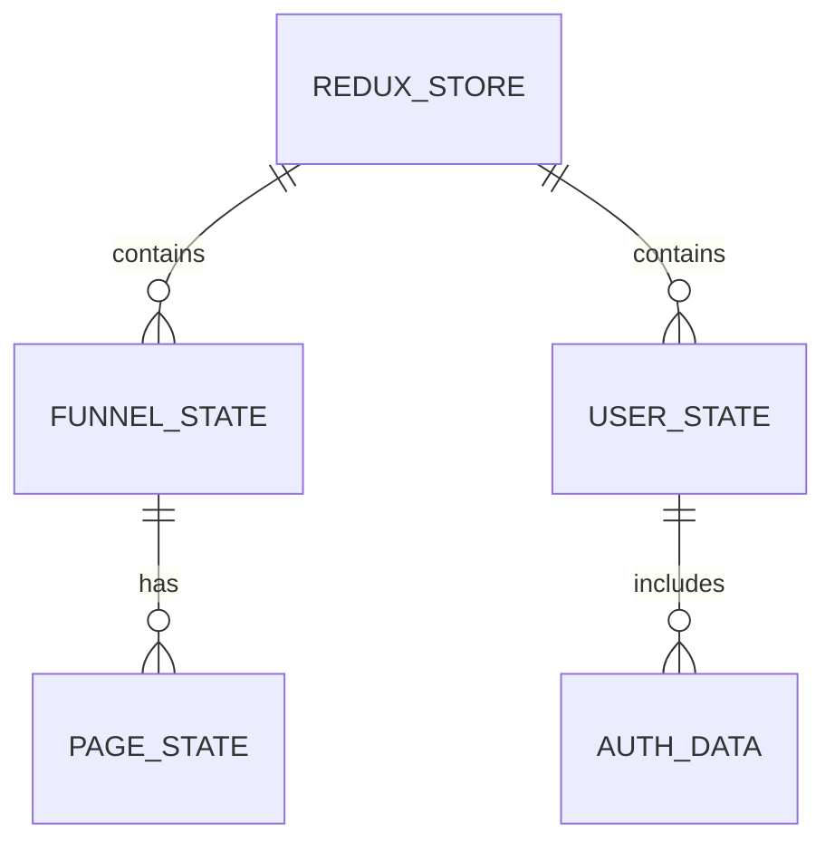

# **Frontend Development Documentation for FunnelFlow**

---

## **Table of Contents**
1. **Frontend Architecture Overview**
2. **Technology Stack**
3. **Folder Structure**
4. **Component Design System**
5. **State Management**
6. **API Integration**
7. **Authentication Flow**
8. **Responsive Design Approach**
9. **Testing Strategy**
10. **Performance Optimization**
11. **Deployment Pipeline**
12. **Sample Code & Data**
13. **ER Diagram for Frontend-State Relations**

---

## **1. Frontend Architecture Overview**
### **Multi-App Structure**
```
Next.js (Main App)
├─ Dashboard (React.js + Redux)
├─ Website Builder (Draft.js + Canvas)
└─ Static Pages (Marketing Site)
```

### **Data Flow**
```
API Calls (Axios) → Redux Store → Components → DOM
```

---

## **2. Technology Stack**
| **Category**       | **Technologies**                          |
|--------------------|------------------------------------------|
| Framework          | Next.js 13 (App Router)                  |
| UI Library         | React 18 + TypeScript                    |
| State Management   | Redux Toolkit + RTK Query                |
| Styling            | Tailwind CSS + CSS Modules               |
| Form Handling      | React Hook Form + Zod Validation         |
| Drag & Drop        | React DnD                                |
| Charts             | Chart.js                                 |
| Testing            | Jest + React Testing Library             |

---

## **3. Folder Structure**
```bash
src/
├── app/                  # Next.js 13 App Router
│   ├── (dashboard)/      # Auth-protected routes
│   ├── (marketing)/      # Public pages
│   └── layout.tsx
├── components/           # Reusable UI
│   ├── core/             # Buttons, inputs
│   └── modules/          # Funnel/CRM widgets
├── lib/                  # Utilities
│   ├── api/              # API clients
│   └── constants/        # Configs
├── store/                # Redux slices
├── styles/               # Global CSS
└── types/                # TypeScript types
```

---

## **4. Component Design System**
### **Core Components**
1. **`<DataTable>`** - CRM/Product tables  
   ```tsx
   interface DataTableProps<T> {
     data: T[];
     columns: ColumnDef<T>[];
   }
   ```
2. **`<FunnelCanvas>`** - Drag & drop builder  
   ```tsx
   const onDrop = (item: DraggedElement) => {
     dispatch(addElement(item));
   };
   ```
3. **`<AnalyticsChart>`** - Revenue/Click charts  
   ```tsx
   <Line data={chartData} options={responsiveOptions} />
   ```

---

## **5. State Management**
### **Redux Slices**
```ts
// store/funnelSlice.ts
const funnelSlice = createSlice({
  name: 'funnels',
  initialState: [],
  reducers: {
    addFunnel: (state, action: PayloadAction<Funnel>) => {
      state.push(action.payload);
    }
  }
});
```

### **API Caching (RTK Query)**
```ts
// api/funnelApi.ts
export const funnelApi = createApi({
  endpoints: (builder) => ({
    getFunnels: builder.query<Funnel[], number>({
      query: (userId) => `funnels?user_id=${userId}`,
    }),
  }),
});
```

---

## **6. API Integration**
### **Axios Instance**
```ts
// lib/api/client.ts
export const api = axios.create({
  baseURL: process.env.API_URL,
  headers: {
    'Authorization': `Bearer ${getToken()}`,
  },
});
```

### **Typed API Hook**
```tsx
// components/FunnelList.tsx
const { data: funnels } = useGetFunnelsQuery(userId);
```

---

## **7. Authentication Flow**
### **Login Sequence**


### **Protected Routes**
```tsx
// app/(dashboard)/layout.tsx
export default function DashboardLayout() {
  const isAuth = useAppSelector(selectIsAuthenticated);
  return isAuth ? <Outlet /> : <Navigate to="/login" />;
}
```

---

## **8. Responsive Design**
### **Tailwind Breakpoints**
```tsx
<div className="md:flex hidden">Desktop Only</div>
<div className="flex md:hidden">Mobile Only</div>
```

### **Dynamic Viewport Handling**
```tsx
const [isMobile, setIsMobile] = useState(false);

useEffect(() => {
  const checkMobile = () => setIsMobile(window.innerWidth < 768);
  window.addEventListener('resize', checkMobile);
  return () => window.removeEventListener('resize', checkMobile);
}, []);
```

---

## **9. Testing Strategy**
### **Unit Test Example**
```tsx
// tests/Button.test.tsx
test('renders button with text', () => {
  render(<Button>Click Me</Button>);
  expect(screen.getByText(/click me/i)).toBeInTheDocument();
});
```

### **Integration Test**
```tsx
// tests/FunnelCreation.test.tsx
test('creates a funnel', async () => {
  render(<FunnelForm />);
  fireEvent.input(screen.getByLabelText('Name'), { target: { value: 'Test' } });
  fireEvent.click(screen.getByText('Save'));
  await waitFor(() => expect(mockApi).toHaveBeenCalled());
});
```

---

## **10. Performance Optimization**
### **Code Splitting**
```tsx
const DynamicChart = dynamic(() => import('@/components/Chart'), {
  ssr: false,
});
```

### **Bundle Analysis**
```bash
npm run build && npm run analyze
```

---

## **11. Deployment Pipeline**
### **Vercel Config**
```json
// vercel.json
{
  "rewrites": [
    { "source": "/api/(.*)", "destination": "https://api.funnelflow.com/$1" }
  ]
}
```

### **CI/CD Steps**
1. `npm test` → Run Jest tests  
2. `npm run build` → Next.js production build  
3. `git push` → Auto-deploy to Vercel  

---

## **12. Sample Code & Data**
### **Product Table Component**
```tsx
// components/ProductTable.tsx
const columns: ColumnDef<Product>[] = [
  { header: 'Name', accessorKey: 'name' },
  { header: 'Price', cell: ({ row }) => `$${row.original.price}` },
];

<ProductTable 
  data={products} 
  columns={columns} 
/>
```

### **Mock API Response**
```json
// __mocks__/funnels.json
{
  "id": 1,
  "name": "Summer Campaign",
  "pages": [
    { "id": 1, "title": "Landing Page" }
  ]
}
```

---

## **13. ER Diagram for Frontend-State**


---

## **Next Steps**
1. Scaffold Next.js app with `create-next-app`  
2. Implement authentication flow  
3. Build core dashboard components  
4. Connect to Django API endpoints  
5. Set up CI/CD on Vercel  

Need any section expanded? 🎨
