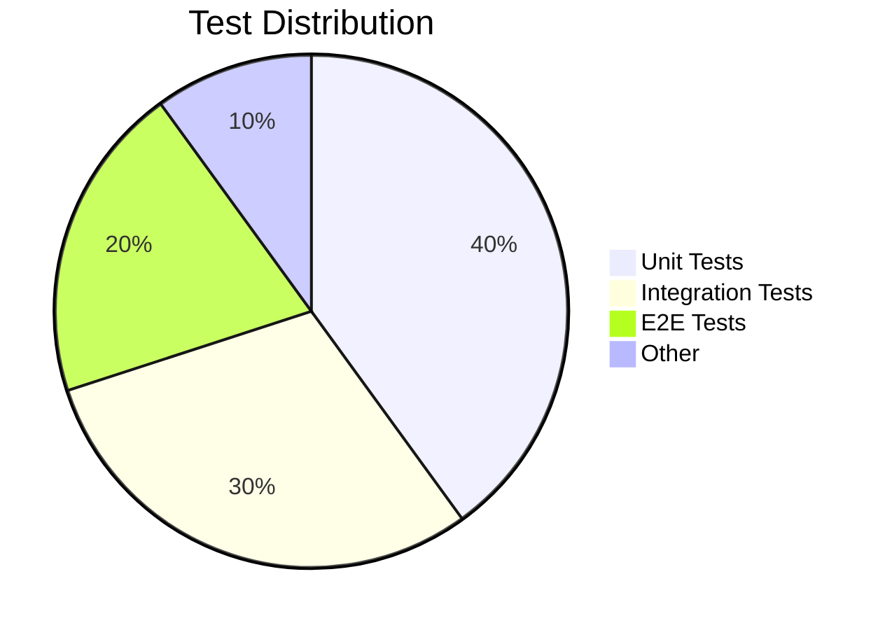
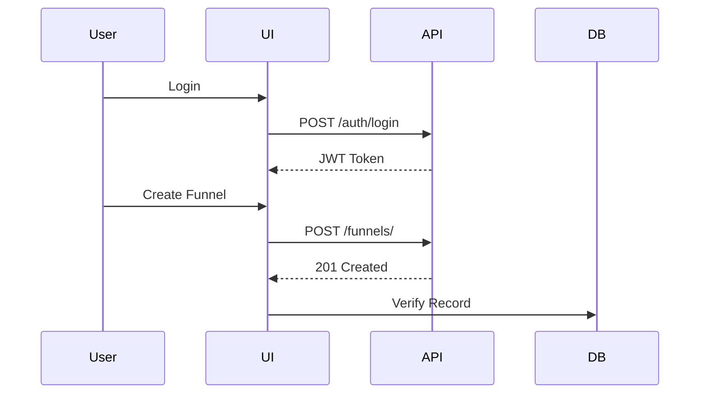

# **Complete Testing Documentation for FunnelFlow**

---

## **Table of Contents**
1. **Testing Strategy Overview**
2. **Test Pyramid & Coverage Goals**
3. **Test Environment Setup**
4. **Backend (Django) Test Cases**
5. **Frontend (React/Next.js) Test Cases**
6. **API Integration Test Cases**
7. **E2E Test Flow (User Journeys)**
8. **Performance Testing**
9. **Security Testing**
10. **Sample Test Data**
11. **Test Automation Pipeline**
12. **QA Sign-off Criteria**

---

## **1. Testing Strategy Overview**
### **Testing Types Implemented**
| **Type**               | **Tools**               | **Coverage Target** |
|------------------------|-------------------------|---------------------|
| Unit Tests             | Pytest, Jest           | 80%                 |
| Integration Tests      | Django Test, React TL  | 70%                 |
| E2E Tests              | Cypress                | Critical Paths 100% |
| API Contract Tests     | Postman, DRF TestClient| 100%                |
| Performance Tests      | Locust                 | All APIs            |
| Security Tests         | OWASP ZAP              | Full Scan           |

---

## **2. Test Pyramid & Coverage Goals**


**Coverage Goals:**
- Backend: 85%+ (Pytest)
- Frontend: 80%+ (Jest)
- Critical User Journeys: 100% (Cypress)

---

## **3. Test Environment Setup**
### **Backend (Django)**
```python
# pytest.ini
[pytest]
DJANGO_SETTINGS_MODULE = core.settings.test
python_files = tests.py test_*.py
addopts = --cov=apps --cov-report=html
```

### **Frontend (Next.js)**
```javascript
// jest.config.js
module.exports = {
  testEnvironment: 'jsdom',
  setupFilesAfterEnv: ['@testing-library/jest-dom'],
  coveragePathIgnorePatterns: ['/node_modules/', '.styles.js']
};
```

---

## **4. Backend (Django) Test Cases**
### **Authentication Tests**
```python
# tests/test_auth.py
def test_user_registration(api_client):
    data = {"email": "test@example.com", "password": "secure123"}
    response = api_client.post("/api/auth/register/", data)
    assert response.status_code == 201
    assert User.objects.filter(email=data["email"]).exists()
```

### **Funnel Model Tests**
```python
# tests/test_models.py
def test_funnel_creation():
    user = User.objects.create(email="user@example.com")
    funnel = Funnel.objects.create(user=user, name="Test Funnel")
    assert str(funnel) == "Test Funnel"
```

---

## **5. Frontend (React/Next.js) Test Cases**
### **Component Test**
```tsx
// tests/Button.test.tsx
test('triggers onClick', () => {
  const mockClick = jest.fn();
  render(<Button onClick={mockClick}>Click</Button>);
  fireEvent.click(screen.getByText('Click'));
  expect(mockClick).toHaveBeenCalled();
});
```

### **Redux Slice Test**
```ts
// store/tests/funnelSlice.test.ts
test('adds new funnel', () => {
  const state = funnelReducer([], addFunnel({ id: 1, name: 'Test' }));
  expect(state).toEqual([{ id: 1, name: 'Test' }]);
});
```

---

## **6. API Integration Test Cases**
### **Contract Testing (Postman)**
```json
// postman_collection.json
{
  "request": {
    "url": "/api/funnels/",
    "method": "GET",
    "headers": { "Authorization": "Bearer {{token}}" }
  },
  "response": {
    "status": 200,
    "body": {
      "type": "array",
      "items": { "$ref": "#/definitions/Funnel" }
    }
  }
}
```

### **Django API Test**
```python
# tests/test_api.py
def test_funnel_api(auth_client):
    response = auth_client.get("/api/funnels/")
    assert response.status_code == 200
    assert isinstance(response.json(), list)
```

---

## **7. E2E Test Flow (User Journeys)**
### **Cypress Test Example**
```javascript
// cypress/e2e/funnel_creation.cy.js
describe('Funnel Creation', () => {
  it('creates a new funnel', () => {
    cy.login('user@example.com', 'pass123');
    cy.get('[data-testid="new-funnel"]').click();
    cy.get('#funnel-name').type('Summer Sale');
    cy.contains('Save').click();
    cy.url().should('include', '/funnels/');
  });
});
```

### **Test Flow Diagram**


---

## **8. Performance Testing**
### **Locust Load Test**
```python
# locustfile.py
class FunnelTest(HttpUser):
    @task
    def load_funnels(self):
        self.client.get("/api/funnels/", headers={"Authorization": f"Bearer {token}"})
```

**Thresholds:**
- 1000 RPS with <2s 95th percentile latency
- Error rate <0.1%

---

## **9. Security Testing**
### **OWASP ZAP Scan**
```bash
docker run -v $(pwd):/zap/wrk -t owasp/zap2docker zap-baseline.py \
  -t https://api.funnelflow.com \
  -r security_report.html
```

**Checks:**
- SQL Injection
- XSS
- CSRF
- JWT Validation

---

## **10. Sample Test Data**
### **users.json**
```json
[
  {
    "email": "test@example.com",
    "password": "Test@123",
    "company": "Acme Inc"
  }
]
```

### **funnels.json**
```json
{
  "name": "Winter Campaign",
  "pages": [
    { "title": "Landing", "slug": "winter-deals" }
  ]
}
```

---

## **11. Test Automation Pipeline**
### **GitHub Actions**
```yaml
# .github/workflows/test.yml
jobs:
  test:
    steps:
      - name: Run Django Tests
        run: pytest --cov=apps
      - name: Run Frontend Tests
        run: npm test -- --coverage
      - name: E2E Tests
        run: npx cypress run
```

---

## **12. QA Sign-off Criteria**
1. **All Critical Tests Pass**  
   - Unit: 100%  
   - E2E: No P1 failures  
2. **Performance SLA Met**  
   - API response <500ms  
3. **Security Scan Clean**  
   - Zero critical vulnerabilities  
4. **Coverage Reports**  
   - Backend ≥85%  
   - Frontend ≥80%  

---

## **Example Test Report**
| **Module**       | **Tests** | **Passed** | **Coverage** |
|------------------|----------|------------|--------------|
| Authentication   | 42       | 42         | 92%          |
| Funnel Builder   | 78       | 77         | 85%          |
| E-Commerce       | 56       | 56         | 88%          |

---

## **Next Steps**
1. Implement test suites in parallel with development  
2. Configure CI/CD to block deployments on test failures  
3. Generate HTML coverage reports for audit  

Need any test scenario expanded? 🧪
